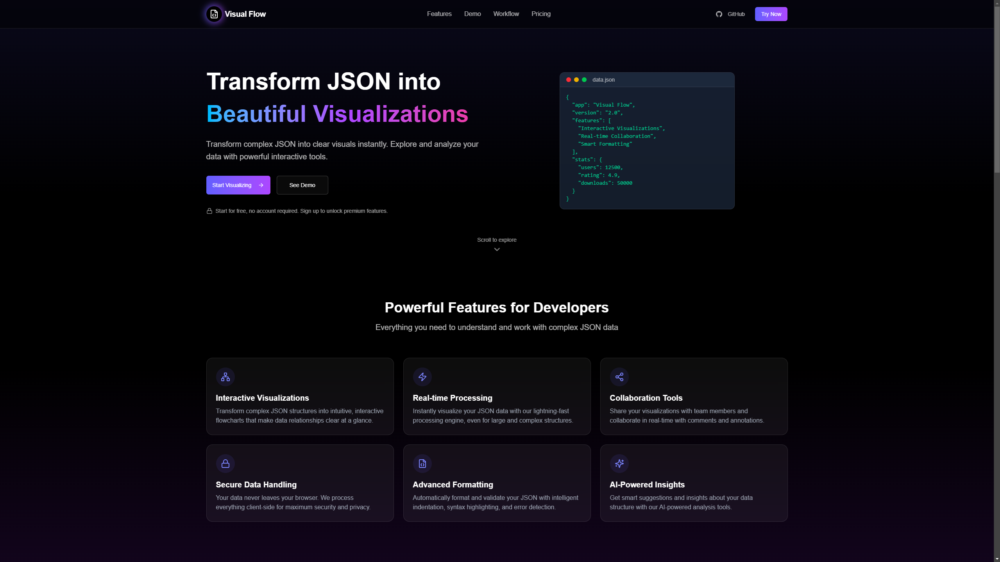

# Visual Flow - Interactive JSON Visualization Tool

Visual Flow is a powerful web application that transforms complex JSON data into intuitive, interactive visualizations. It helps developers understand, analyze, and share JSON structures with ease.

---



---

## 🌐 Live Demo

Visit the live application at [visualflowapp.vercel.app](https://visualflowapp.vercel.app)

---

## ✨ Features

- **Interactive Visualizations**: Transform JSON into intuitive, interactive flowcharts with automatic layout.
- **Real-time Parsing**: Instant validation and error detection as you type.
- **Schema Detection**: Automatically identify and highlight data structures with color-coded nodes.
- **Node Highlighting**: Easily identify relationships between data elements with interactive highlighting.
- **Search Functionality**: Quickly find specific values or keys in complex structures.
- **Export Options**: Save visualizations as SVG, PNG, or JPEG for documentation or presentations.
- **AI-Powered OCR**: Extract JSON from images using Google Gemini's advanced image recognition.
- **Local Storage**: Automatically save your work with configurable auto-save functionality.
- **Sharing Capabilities**: Share your visualizations with team members.
- **Dark Mode**: Optimized for comfortable viewing in any environment.
- **Premium Features**: Access advanced visualization options with subscription plans.
- **Monaco Editor Integration**: Professional code editing experience with syntax highlighting.

---

## 🚀 Getting Started

This is a [Next.js](https://nextjs.org) project. To run it locally:

### Prerequisites

- Node.js (version 18 or higher)
- npm or yarn

### Installation Steps

1.  **Clone the repository**

    ```bash
    git clone https://github.com/samizak/Visual-Flow.git
    ```

2.  **Navigate to the project directory**

    ```bash
    cd Visual-Flow
    ```

3.  **Install dependencies**

    ```bash
    npm install
    ```

4.  **Run the development server**

    ```bash
    npm run dev
    ```

Open [http://localhost:3000](http://localhost:3000) with your browser to see the result.

You can start editing the page by modifying `app/page.tsx`. The page auto-updates as you edit the file.

---

## 🛠️ Technologies Used

- **Frontend**:
  - [Next.js 15.2](https://nextjs.org)
  - [React 19](https://reactjs.org)
  - [TailwindCSS 4](https://tailwindcss.com)
- **Visualization**:
  - [React Flow 12.4](https://reactflow.dev) (@xyflow/react)
  - [Dagre 1.1.4](https://github.com/dagrejs/dagre) for graph layouts
- **Code Editing**:
  - [Monaco Editor 4.7](https://microsoft.github.io/monaco-editor/)
- **3D Effects**:
  - [Three.js 0.174](https://threejs.org)
  - [React Three Fiber 9.1](https://docs.pmnd.rs/react-three-fiber)
  - [Drei 10.0](https://github.com/pmndrs/drei)
- **Animation**:
  - [Framer Motion 12.5](https://www.framer.com/motion/)
- **Authentication & Backend**:
  - [Supabase JS 2.49](https://supabase.com)
  - [Supabase SSR 0.5](https://supabase.com)
- **Payment Processing**:
  - [Stripe 17.7](https://stripe.com)
  - [Stripe JS 6.0](https://stripe.com)
- **State Management**:
  - [Zustand 5.0](https://github.com/pmndrs/zustand)
- **UI Components**:
  - [Radix UI](https://www.radix-ui.com/) (various components)
  - [Lucide React 0.479](https://lucide.dev)
  - [Sonner 2.0](https://sonner.emilkowal.ski/) for toast notifications
  - [Vaul 1.1](https://vaul.emilkowal.ski/) for drawers
- **Image Processing**:
  - [html-to-image 1.11](https://github.com/bubkoo/html-to-image)
  - [file-saver 2.0](https://github.com/eligrey/FileSaver.js)
- **AI Integration**:
  - [Google Generative AI 0.24](https://ai.google.dev/)

---

## 🧪 Testing

The project uses Jest and React Testing Library for testing:

```bash
# Run tests
npm test

# Run tests in watch mode
npm run test:watch

# Generate test coverage report
npm run test:coverage
```

---

## 🔐 Environment Variables

To run this project, you'll need to set up the following environment variables in a `.env.local` file at the root of your project:

- `NEXT_GEMINI_API_KEY`: Google Gemini AI API key for Gemini integration
- `NEXT_PUBLIC_STRIPE_PUBLISHABLE_KEY`: Stripe publishable key for payments
- `STRIPE_SECRET_KEY`: Stripe secret key for payments
- `NEXT_PUBLIC_STRIPE_BUY_BUTTON_ID`: Stripe buy button ID for payments
- `MONTHLY_PRICE_ID`: Stripe price ID for monthly subscriptions
- `YEARLY_PRICE_ID`: Stripe price ID for yearly subscriptions
- `NEXT_PUBLIC_APP_URL`: Application URL
- `NEXT_PUBLIC_SUPABASE_URL`: Supabase URL for authentication and database
- `NEXT_PUBLIC_SUPABASE_ANON_KEY`: Supabase anonymous key for authentication and database

To obtain these keys:

1.  Create a Supabase project at [supabase.com](https://supabase.com)
2.  Set up a Stripe account at [stripe.com](https://stripe.com)

⚠️ **Important**: Never commit your `.env.local` file to version control. It's already included in `.gitignore` to prevent accidental exposure of your API keys.

---

## 📁 Project Structure

```
json-visualiser/
├── app/                # Next.js app directory
│   ├── api/            # API routes
│   ├── auth/           # Authentication pages
│   ├── editor/         # JSON editor and visualization
│   ├── landing-page/   # Marketing landing page
│   ├── pricing/        # Subscription plans
│   └── protected/      # Premium features
├── components/         # Global UI components
│   ├── Auth/           # Authentication components
│   ├── OCR/            # Optical Character Recognition
│   ├── PremiumFeatures/# Premium subscription features
│   ├── ui/             # UI components
│   └── Visualizers/    # Visualization components
├── constants/          # Application constants
├── hooks/              # Custom React hooks
├── lib/                # Utility functions
├── public/             # Static assets
├── services/           # API service functions
├── store/              # State management with Zustand
├── styles/             # CSS styles
│   ├── base/           # Base styles
│   ├── components/     # Component styles
│   └── utils/          # Utility styles
└── utils/              # Helper utilities
```

---

## 🤝 Contributing

Contributions are welcome! If you'd like to contribute:

1.  Fork the repository
2.  Create a feature branch (`git checkout -b feature/amazing-feature`)
3.  Commit your changes (`git commit -m 'Add some amazing feature'`)
4.  Push to the branch (`git push origin feature/amazing-feature`)
5.  Open a Pull Request

---

## 📝 License

This project is licensed under the MIT License - see the `LICENSE` file for details.
